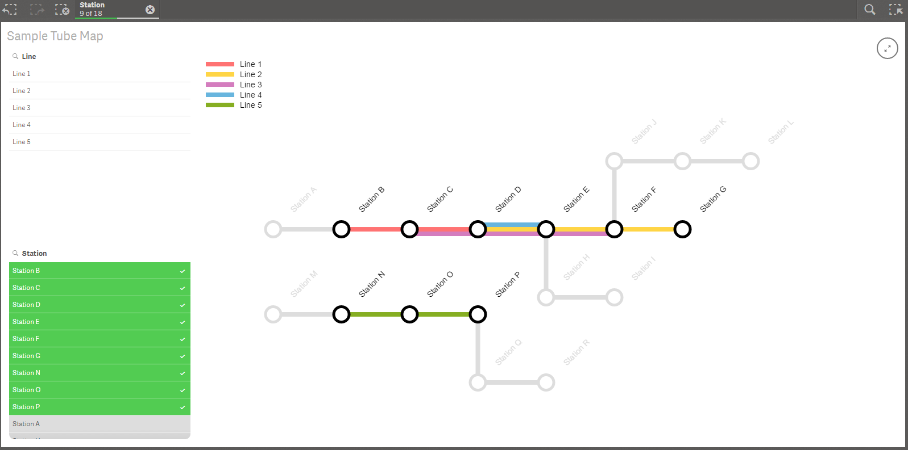

## Sense Tube Map Extension
### A Visualisation Extension for Qlik Sense that uses the HTML5 Canvas based [tubemap-viz](https://github.com/websy85/tubemap-viz) library to represent data in the style of a Tube/Metro map.

The extension is a work in progress but feel free to use, abuse and contribute. Enjoy.

If you'd like to use the same visualisation on top of the Engine API or in any other web environment outside of the Qlik Sense client framework then you can use the core [tubemap-viz](https://github.com/websy85/tubemap-viz) library.

#### Installation
1. Download the built extension **[here](https://github.com/websy85/sense-tube-map-extension/raw/master/build/sense-tube-map.zip)**.
2. Import the extension into Qlik Sense Enterprise **or** extract the files into the Qlik Sense Desktop extensions directory.
3. A sample app can be found **[here](https://github.com/websy85/sense-tube-map-extension/raw/master/TubeMapExample.qvf)**.

#### Data Requirements
The map can handle the following Data
* **Line** (required) - A dimension containing the name of your 'line' data
* **Station** (required) - A dimension containing the name of your 'station' data
* **Colour** - A dimension containing the colour to be used for the line. If omitted default colours will be used (up to a maximum of 5 lines)
* **DistanceToNextStation** - A dimension containing the distance to the next station. A scale will be calculated based on the min and max values found in this column. If omitted station will be equidistant.
* **StationSize** - A measure that can be used to change the size of the station.

For further information and documentation please see [tubemap-viz](https://github.com/websy85/tubemap-viz).

#### Examples
##### Lines, Stations and Colours

##### With selections

##### Varying Distances

##### Station Size

